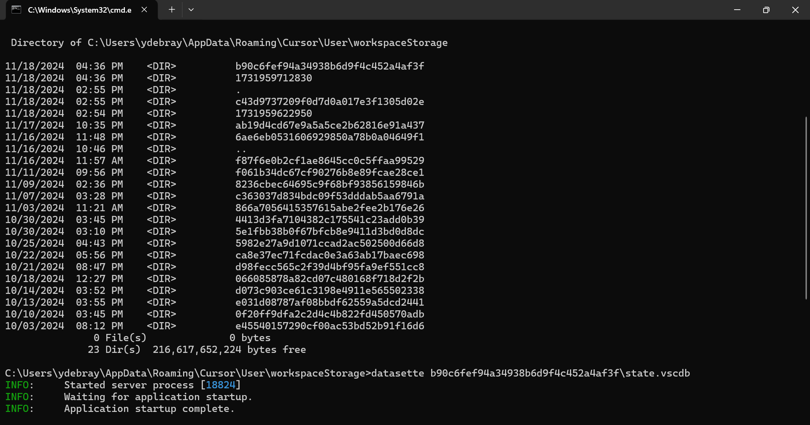

# Cursor History 🕒

https://cursor-history.streamlit.app/


some advanced hacking shit:



- Go to `%APPDATA%\Cursor\User`
- then in one of the folders representing you history for one project
- `datasette f87f6e0b2cf1ae8645cc0c5ffaa99529\state.vscdb`
- Enter the following SQL:

```sql
SELECT
rowid,
[key],
value
FROM
ItemTable
WHERE
[key] IN ("aiService.prompts", "workbench.panel.aichat.view.aichat.chatdata")
```


Resources:
- https://forum.cursor.com/t/chat-history-folder/7653
- https://github.com/abakermi/vscode-cursorchat-downloader
- https://github.com/thomas-pedersen/cursor-chat-browser
- https://github.com/somogyijanos/cursor-chat-export
- https://datasette.io/
